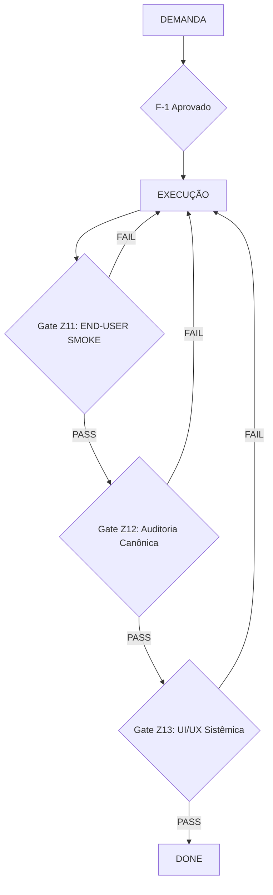

# END-FIRST v2 — Planejamento como Artefato Canônico

**Versão:** 1.0  
**Data:** 19 de Janeiro de 2026  
**Status:** Canônico (Evolução do Método)  
**Autoria:** CEO (Joubert Jr) + Manus AI  
**Path Canônico:** `/METODO/END_FIRST_V2.md`

---

## 🎯 O QUE É END-FIRST v2

END-FIRST v2 é a **evolução canônica** do método END-FIRST que introduz **F-1 (Planejamento Canônico)** como estágio obrigatório e bloqueante antes de qualquer execução.

**Princípio fundamental:**
> "Planejamento é artefato de primeira classe. Executor apenas executa."

---

## 🔥 POR QUE END-FIRST v2 EXISTE

### Problema Observado (Evidência Empírica)

Durante a execução real de um projeto complexo, foi observado **retrabalho sistemático** entre:
- Arquiteto (humano)
- Executor (Cursor)
- Validações manuais repetidas

**O problema não foi:**
- ❌ Técnico
- ❌ Qualidade de código
- ❌ Execução do Cursor

**A causa raiz foi metodológica:**

O método END-FIRST atual **não trata planejamento como artefato canônico governado**, o que gera:
- Interpretação durante execução
- Endurecimento tardio de regras
- Ciclos repetidos de validação
- Overhead cognitivo e operacional

---

### Diagnóstico (Causa Raiz)

O método END-FIRST atualmente:
- Assume que "planejar" ≈ "executar"
- Não exige aprovação explícita do plano
- Não diferencia planejamento, TODO e execução
- Permite que o executor interprete regras durante a execução

**👉 Isso não escala sob carga real.**

---

## 🔒 F-1 — PLANEJAMENTO CANÔNICO (BLOQUEANTE)

### Definição

**F-1** é o estágio obrigatório de **Planejamento Canônico** que deve ser concluído e aprovado antes de qualquer execução.

**Função:**
- Transformar demanda em plano executável
- Eliminar interpretação durante execução
- Estabilizar arquitetura e governança antes de código

---

### END (Resultado Esperado de F-1)

Ao final de F-1, devem existir:

- ✅ **1 documento único de planejamento canônico**
- ✅ **1 TODO canônico derivado do plano**
- ✅ **Escopo DO / DON'T explícito**
- ✅ **Ordem de execução explícita**
- ✅ **Critérios de FAIL explícitos**
- ✅ **Strings de prova definidas** (quando aplicável)

---

### DONE WHEN (Critérios de Conclusão)

F-1 está concluída quando:

- ✅ Declaração explícita no relatório: **"F-1 aprovada"**
- ✅ Nenhum comando foi executado
- ✅ Nenhum código foi alterado
- ✅ Plano foi aprovado pelo CEO ou arquiteto responsável

---

### PROIBIÇÕES (FAIL Automático)

Durante F-1, é **estritamente proibido:**

- ❌ Executar comandos
- ❌ Criar código
- ❌ Criar automações
- ❌ "Validar rapidamente"
- ❌ Interpretar regras durante execução

**Frase canônica:**
> "F-1 é planejamento, não execução. Executar durante F-1 é FAIL automático."

---

## 🧱 REGRA GLOBAL (CANÔNICA)

> **"Planejamento é artefato de primeira classe."**

**Implicações:**

- O executor (Cursor) **apenas executa**
- Arquitetura, governança e escopo **só existem antes da F-1 aprovada**
- Interpretação acontece **durante planejamento**, não durante execução
- Retrabalho de validação é **eliminado por design**

---

## 📊 QUANDO F-1 É OBRIGATÓRIO

### F-1 é obrigatório para:

- ✅ Projetos complexos (múltiplos arquivos, múltiplas etapas)
- ✅ Mudanças estruturais no método
- ✅ Implementação de novos produtos
- ✅ Demandas com dependências entre etapas
- ✅ Demandas com critérios de FAIL não triviais

### F-1 é opcional para:

- ❌ Demandas simples (1 arquivo, 1 etapa, escopo claro)
- ❌ Correções triviais (typo, formatação)
- ❌ Atualizações de documentação sem impacto estrutural

**Regra de decisão:**
> Se há dúvida se F-1 é necessário, F-1 é necessário.

---

## 🔄 FLUXO END-FIRST v2

### Fluxo Completo (com F-1)

```
DEMANDA → F-1 (Planejamento) → APROVAÇÃO → CARD → EXECUÇÃO → EVIDÊNCIA → JULGAMENTO
```

### Detalhamento de F-1

1. **Input:** DEMANDA com END explícito
2. **Processo:**
   - Criar documento de planejamento
   - Definir TODO canônico
   - Definir escopo DO / DON'T
   - Definir ordem de execução
   - Definir critérios de FAIL
   - Definir strings de prova (se aplicável)
3. **Output:** Plano aprovado com declaração "F-1 aprovada"
4. **Bloqueio:** Execução só inicia após aprovação explícita

---

## 📦 ESTRUTURA DO DOCUMENTO DE PLANEJAMENTO (F-1)

### Template Mínimo

```markdown
# PLANEJAMENTO CANÔNICO — [NOME DA DEMANDA]

## END (da demanda original)
[Copiar END da demanda]

## TODO CANÔNICO
- [ ] Etapa 1: [descrição objetiva]
- [ ] Etapa 2: [descrição objetiva]
- [ ] Etapa N: [descrição objetiva]

## ESCOPO

### DO (fazer)
- ✅ [ação 1]
- ✅ [ação 2]

### DON'T (não fazer)
- ❌ [ação proibida 1]
- ❌ [ação proibida 2]

## ORDEM DE EXECUÇÃO
1. [Etapa 1]
2. [Etapa 2]
3. [Etapa N]

## CRITÉRIOS DE FAIL
- ❌ [condição que invalida execução]
- ❌ [condição que invalida execução]

## STRINGS DE PROVA (quando aplicável)
- `[string esperada no output]`
- `[string esperada no log]`

## APROVAÇÃO
**Status:** [PENDENTE / APROVADO]
**Aprovado por:** [nome]
**Data:** [YYYY-MM-DD]

**Declaração:** "F-1 aprovada"
```

---

## 🎯 IMPACTO ESPERADO

Após END-FIRST v2:

- ✅ **Zero retrabalho de validação**
- ✅ **Zero interpretação durante execução**
- ✅ **Cursor atua como executor literal**
- ✅ **Arquitetura e governança ficam estáveis**
- ✅ **Redução drástica de overhead cognitivo**
- ✅ **Método passa a escalar para projetos complexos**

---

## 🧠 INTEGRAÇÃO COM MÉTODO ATUAL

### Relação com ODs Existentes

**OD-007 (END é pré-condição absoluta)**
- F-1 **reforça** OD-007: planejamento tem END próprio

**OD-009 (Processo > Disciplina)**
- F-1 **implementa** OD-009: bloqueio estrutural elimina dependência de "lembrar de planejar"

**OD-010 (RESULT é primeira classe)**
- F-1 **aplica** OD-010: planejamento é resultado verificável, não processo

**OD-011 (Metacognição fora do caminho crítico)**
- F-1 **resolve** OD-011: interpretação acontece em F-1, não durante execução

**OD-012 (nova):** Planejamento é artefato de primeira classe
- F-1 **cristaliza** OD-012: planejamento tem END, DONE WHEN, FAIL

---

### Relação com Pilar ENDFIRST

END-FIRST v2 **não substitui** o Pilar ENDFIRST.

**Pilar ENDFIRST:**
- Transforma intenção difusa → resultado explícito (ENDFIRST_SPEC)
- Ritual de 6 perguntas + 11 bloqueios

**END-FIRST v2 (F-1):**
- Transforma demanda → plano executável
- Bloqueio antes de execução

**Relação:**
```
Pilar ENDFIRST → DEMANDA → F-1 (Planejamento) → EXECUÇÃO
```

---

## 📌 EXEMPLOS PRÁTICOS

### Exemplo 1: Demanda Simples (F-1 opcional)

**DEMANDA:** Corrigir typo em README.md

**Análise:**
- 1 arquivo
- 1 etapa
- Escopo trivial
- Sem dependências

**Decisão:** F-1 não necessário (fluxo direto: DEMANDA → CARD → EXECUÇÃO)

---

### Exemplo 2: Demanda Complexa (F-1 obrigatório)

**DEMANDA:** Implementar END-FIRST v2

**Análise:**
- 5 documentos impactados
- Múltiplas etapas
- Escopo complexo
- Dependências entre documentos

**Decisão:** F-1 obrigatório

**F-1 criado:**
- TODO canônico com 5 etapas
- Escopo DO/DON'T explícito
- Ordem de execução definida
- Critérios de FAIL listados
- Aprovação explícita: "F-1 aprovada"

---

## 🚨 BLOQUEIOS E VALIDAÇÕES

### Bloqueio Estrutural

**Cursor (executor) deve verificar:**
1. Demanda é complexa?
2. Existe documento de F-1?
3. F-1 foi aprovado? (declaração "F-1 aprovada")

**Se F-1 é necessário e não existe:**
> "Esta demanda requer F-1 (Planejamento Canônico). Sem F-1 aprovada, não posso executar."

---

### Validação de F-1

**Checklist de aprovação:**
- [ ] TODO canônico existe
- [ ] Escopo DO/DON'T explícito
- [ ] Ordem de execução definida
- [ ] Critérios de FAIL listados
- [ ] Nenhum comando foi executado durante F-1
- [ ] Nenhum código foi criado durante F-1
- [ ] Declaração "F-1 aprovada" presente

---

## 📜 EVIDÊNCIA

Esta evolução nasce de **uso real do método**, com múltiplos ciclos de retrabalho documentados durante:
- Endurecimento tardio de regras
- Redefinição de escopo
- Validações repetidas

**Não é opinião. É evidência empírica.**

---

## 🎯 FRASE CANÔNICA

> **"Planejamento é artefato de primeira classe. Executor apenas executa."**

---

## 📝 TEMPLATE CANÔNICO DE DEMANDA

### Relação entre F-1 e Template Canônico

**Template Canônico de Demanda:**
- Define estrutura obrigatória de toda demanda
- 11 seções obrigatórias
- Frases canônicas explícitas
- Regra de UX canônica (scroll interno proibido)

**F-1 (Planejamento Canônico):**
- Transforma demanda (já no template) em plano executável
- Obrigatório para demandas complexas
- Opcional para demandas simples

**Fluxo completo:**
```
Demanda (Template Canônico) → F-1 (Planejamento) → Execução
```

### Bloqueio Estrutural

**Regra:**
> Demandas fora do template são FAIL estrutural.

**Bloqueios:**
- 🔒 Manus não aceita demandas fora do template
- 🔒 Cursor não executa demandas fora do template
- 🔒 CEO não revisa demandas que não sigam o template

**Documento canônico:** `/METODO/TEMPLATE_DEMANDA_CANONICA.md`

---

## 🔒 Gate Z12 — Auditoria Canônica (Obrigatório)

O **Gate Z12** é um gate estrutural e obrigatório que valida a conformidade da execução com o método END-FIRST. Sua função é garantir que a demanda foi executada corretamente, que a documentação é íntegra e que a coerência entre planejamento e resultado é total. Este gate é a última verificação sistêmica antes da entrega.

> **Frase Canônica:** "Sem auditoria sistemática, DONE é apenas uma declaração. Com ela, DONE vira um fato."

### Fluxo de Posição:



**Ordem canônica:**
```
Z0 (Estrutura) → Z11 (END-USER SMOKE) → Z12 (Auditoria Canônica) → Z13 (UI/UX Sistêmica) → DONE
```

### Definição e Propósito:

O Gate Z12 move a responsabilidade da verificação de conformidade de uma revisão humana, suscetível a erros e inconsistências, para um processo sistêmico e automatizável. Ele serve como uma barreira de qualidade que impede que problemas de método, documentação ou coerência cheguem à fase de entrega.

### Regras de Execução:

1.  **Obrigatoriedade:** O Gate Z12 deve ser executado para **toda e qualquer demanda** antes da declaração de DONE.
2.  **Condição de Bloqueio:** Uma falha (FAIL) em qualquer um dos sub-gates do Z12 **proíbe a declaração de DONE**. A demanda deve ser corrigida e o gate re-executado até obter um PASS.
3.  **Execução:** O Gate Z12 possui **automação mínima implementada** via `make z12` (Z12-A e Z12-B automatizados). Z12-C (Coerência) ainda requer validação manual assistida por IA (Cursor/Claude), utilizando o checklist canônico definido em `CURSOR_INSTRUCTIONS.md`. Scripts disponíveis: `tools/z12_audit.sh` (método) e `tools/z12_docs_check.sh` (documentação).

### Sub-Gates:

O Gate Z12 é composto por três auditorias específicas, que validam diferentes aspectos da entrega:

-   **Z12-A (Auditoria de Método):** Garante que a estrutura fundamental do método foi seguida.
-   **Z12-B (Auditoria de Documentação):** Garante a qualidade e integridade dos artefatos de documentação.
-   **Z12-C (Auditoria de Coerência):** Garante que o que foi planejado, executado e entregue estão em perfeita sincronia.

Ao institucionalizar o Gate Z12, o método END-FIRST fecha seu loop estrutural de auditoria de método, transformando a confiança em garantia e a revisão manual em validação sistêmica.

---

## 🔒 Gate Z13 — UI/UX Sistêmica (Obrigatório para demandas com UI)

O **Gate Z13** é um gate de validação binário que garante que a interface do usuário final (UI) adere a um padrão mínimo de consistência, legibilidade e previsibilidade. Sua função é eliminar a subjetividade da avaliação de UI e transformá-la em um checklist de conformidade técnica, auditável e não-opinativo.

> **Frase Canônica:** "Z13 não decide se a UI é boa. Decide se ela é aceitável como produto de engenharia."

### Definição e Propósito:

O Gate Z13 **não avalia se a UI é "bonita" ou "agradável"**. Ele valida se a UI segue as regras sistêmicas definidas, garantindo que o resultado final seja um produto de engenharia, não de arbitragem artística.

### Regras de Execução:

1.  **Aplicabilidade:** O Gate Z13 deve ser executado para **toda demanda que envolva UI/UX** antes da declaração de DONE.
2.  **Condição de Bloqueio:** Uma falha (FAIL) em qualquer critério do Z13 **proíbe a declaração de DONE**. A demanda deve ser corrigida e o gate re-executado até obter um PASS.
3.  **Execução:** O Gate Z13 é **manual** (checklist + screenshot). Executor preenche checklist de 9 critérios (Hierarquia, Consistência, Interação) e anexa screenshot como evidência.

### 4 Regras Canônicas (Não Negociáveis):

-   **R1:** Se tudo tem o mesmo peso visual, a UI falhou.
-   **R2:** Conteúdo do usuário e metadados de auditoria não podem ocupar o mesmo plano visual.
-   **R3:** Uma UI que exige explicação externa para ser usada é FAIL.
-   **R4:** Inconsistência entre componentes idênticos é FAIL.

### 9 Critérios de Aceitação (PASS/FAIL):

**Eixo 1: Hierarquia e Layout (3 critérios)**
-   H1: Hierarquia Tipográfica
-   H2: Escala de Espaçamento
-   H3: Alinhamento

**Eixo 2: Consistência de Componentes (3 critérios)**
-   C1: Consistência de Cor
-   C2: Consistência de Borda
-   C3: Consistência de Sombra

**Eixo 3: Interação e Feedback (3 critérios)**
-   I1: Feedback de Hover
-   I2: Estado de Foco Visível
-   I3: Sem Conteúdo de Debug

**Documentação completa:** `/METODO/GATE_Z13_UI_UX_SISTEMICA.md`

Ao institucionalizar o Gate Z13, o método END-FIRST fecha seu loop estrutural de UI/UX, transformando avaliação subjetiva em validação objetiva e removendo o CEO do loop de decisão de interface.

---

## 🔒 Governança de Qualidade para Execução Longa e Streaming

O método END-FIRST v2 define **governança explícita de qualidade** para demandas com **execução longa, streaming de progresso e persistência de resultado**.

> **Frase Canônica:** "Qualidade não é complexidade; é sobrevivência sob falha."

### Classificação de Demandas

Demandas são classificadas em **classes estruturais** que determinam obrigatoriedade de gates:

- **Classe A:** Execução Longa com Streaming e Persistência → **Z10 obrigatório**
- **Classe B:** Operação Crítica de Negócio → Z10 recomendado
- **Classe C:** Interface de Usuário Complexa → Z11 e Z13 obrigatórios
- **Classe D:** Integração Externa → Z10 recomendado

**Documentação completa:** `/METODO/CLASSIFICACAO_TIPOS_DEMANDA.md`

### Regra Binária de Z10

**Para demandas Classe A:**

```
SE demanda ∈ Classe A
ENTÃO Z10 é OBRIGATÓRIO
  OU dispensa explícita e registrada
```

**Dispensa válida requer:**
1. Justificativa técnica explícita
2. Aprovação do CEO ou arquiteto responsável
3. Registro na demanda
4. Análise de risco documentada

**Ausência de decisão explícita = FAIL automático**

**Documentação completa:** `/METODO/GOVERNANCA_GATES.md`

### Provas Mínimas de Robustez

**Demandas Classe A exigem 4 provas mínimas:**

1. **Monotonicidade de Progresso:** Progresso nunca regride
2. **Persistência de Resultado:** Resultado não depende de conexão ativa
3. **Retomada Após Falha:** Execução sobrevive a desconexão do cliente
4. **Durabilidade de Resultado:** Resultado não se perde após falha de stream

**Formas de prova aceitas:**
- Teste automatizado
- Prova documental (contrato de API, arquitetura)
- Inspeção de código

**Provas NÃO aceitas:**
- ❌ "Funcionou no meu teste manual"
- ❌ "HTML 200"
- ❌ "Testes antigos passam"
- ❌ "Parece robusto"

**Documentação completa:** `/METODO/PROVAS_MINIMAS_ROBUSTEZ.md`

### Evidência de Aplicação Retroativa

A governança de qualidade foi aplicada retroativamente em casos reais, demonstrando que:

- DEMANDA-PROD-002 (Processamento de Log com SSE) teria sido classificada como Classe A
- Z10 teria sido obrigatório
- Bug de progresso regressivo teria sido detectado antes de PASS
- Bug de resultado perdido teria sido bloqueado

**Documentação completa:** `/EVIDENCIAS/aplicacao_retroativa_metodo_005.md`

### Origem

Esta governança foi formalizada via **DEMANDA-METODO-005 v2.0** (Aplicação Obrigatória de Qualidade em Execução Longa e Streaming), executada em 2026-01-20.

**Referência:** `/DEMANDAS_MANUS/DEMANDA_METODO-005_ROBUSTEZ_EXECUCAO_LONGA.md`

---

## 📜 DECLARAÇÃO DO CEO

Reconheço esta evolução como canônica e obrigatória para o método ENDFIRST.

END-FIRST v2 passa a governar:
- Execução de demandas complexas
- Separação entre planejamento e execução
- Bloqueio estrutural de interpretação durante execução

**Status:** CANÔNICO  
**Aplicação:** Imediata para demandas complexas  
**Versão:** 1.5

**Histórico de mudanças:**
- v1.0 (2026-01-19): Versão inicial (F-1 Planejamento Canônico)
- v1.1 (2026-01-19): Adicionada seção Template Canônico de Demanda
- v1.2 (2026-01-19): Adicionado Gate Z12 — Auditoria Canônica (manual até existir runner CI/script)
- v1.3 (2026-01-19): Adicionado Gate Z13 — UI/UX Sistêmica (elimina subjetividade de UI)
- v1.4 (2026-01-20): Adicionada Governança de Qualidade para Execução Longa e Streaming (DEMANDA-METODO-005)

---

**Governado por:** `/METODO/PILAR_ENDFIRST.md`  
**Path Canônico:** `/METODO/END_FIRST_V2.md`  
**Refs:** #12
