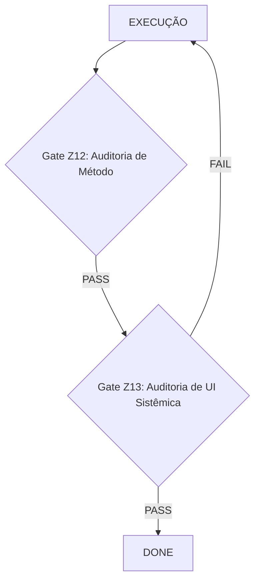

# Gate Z13 — UI/UX Sistêmica (Binário)

---
document_id: GATE_Z13_UI_UX_SISTEMICA
type: canonical_gate
owner: CEO (Joubert Jr)
status: active
governed_by: /METODO/PILAR_ENDFIRST.md
version: 1.0
created_at: 2026-01-19
---

## 🔒 Gate Z13 — UI/UX Sistêmica (END-USER LEGIBILITY)

### 1. Propósito (O que este Gate Garante)

O **Gate Z13** é um gate de validação binário que garante que a interface do usuário final (UI) adere a um padrão mínimo de consistência, legibilidade e previsibilidade. Sua função é eliminar a subjetividade da avaliação de UI e transformá-la em um checklist de conformidade técnica, auditável e não-opinativo.

Este gate **não avalia se a UI é "bonita" ou "agradável"**. Ele valida se a UI segue as regras sistêmicas definidas, garantindo que o resultado final seja um produto de engenharia, não de arbitragem artística.

### 2. Fluxo de Posição

O Gate Z13 é o último gate de verificação antes da entrega final ao usuário. Ele ocorre após o Gate Z12 (Auditoria Canônica de Método) e antes da declaração de DONE.



**Ordem canônica:**
```
Z0 (Estrutura) → Z11 (END-USER SMOKE) → Z12 (Auditoria Canônica) → Z13 (UI/UX Sistêmica) → DONE
```

### 3. Regras Canônicas (Não Negociáveis)

Estas são as leis que governam a filosofia deste gate. Uma violação de qualquer uma destas regras implica em um FAIL conceitual.

**R1: Se tudo tem o mesmo peso visual, a UI falhou.**  
A ausência de hierarquia é um defeito, não um estilo.

**R2: Conteúdo do usuário e metadados de auditoria não podem ocupar o mesmo plano visual.**  
Informações para o desenvolvedor (ex: IDs, logs de debug) não devem poluir a interface do usuário final.

**R3: Uma UI que exige explicação externa para ser usada é FAIL.**  
A interface deve ser autoexplicativa para as operações básicas.

**R4: Inconsistência entre componentes idênticos é FAIL.**  
Um botão deve ser sempre o mesmo botão.

---

### 4. Critérios de Aceitação (Checklist Binário PASS/FAIL)

Para um incremento obter PASS no Gate Z13, **TODOS** os critérios a seguir devem ser atendidos. A falha em um único critério resulta em FAIL automático para o gate inteiro, bloqueando a declaração de DONE.

#### Eixo 1: Hierarquia e Layout

| Critério | Verificação (PASS/FAIL) |
|----------|-------------------------|
| **H1: Hierarquia Tipográfica** | Existe uma distinção clara e consistente entre títulos (H1, H2, H3), parágrafos e legendas? (FAIL se fontes de níveis diferentes são indistinguíveis). |
| **H2: Escala de Espaçamento** | Todos os espaçamentos (margens, paddings) entre elementos seguem uma escala de tokens predefinida (ex: 4, 8, 12, 16, 24, 32px)? (FAIL se espaçamentos são aleatórios ou "mágicos"). |
| **H3: Alinhamento** | Todos os elementos estão visivelmente alinhados em um grid? (FAIL se elementos parecem "flutuar" ou estão desalinhados sem propósito claro). |

#### Eixo 2: Consistência de Componentes

| Critério | Verificação (PASS/FAIL) |
|----------|-------------------------|
| **C1: Consistência de Cor** | Todas as cores usadas (primária, secundária, erro, sucesso) vêm de uma paleta de tokens definida? (FAIL se cores são hard-coded e fora da paleta). |
| **C2: Consistência de Borda** | Todos os elementos interativos (botões, cards, inputs) usam o mesmo valor de border-radius definido nos tokens? (FAIL se há múltiplos estilos de arredondamento). |
| **C3: Consistência de Sombra** | Todas as sombras aplicadas (em cards, modais) seguem os tokens de sombra predefinidos? (FAIL se há sombras customizadas). |

#### Eixo 3: Interação e Feedback

| Critério | Verificação (PASS/FAIL) |
|----------|-------------------------|
| **I1: Feedback de Hover** | Todos os elementos clicáveis (botões, links, cards interativos) possuem um estado de hover visualmente distinto? (FAIL se um elemento clicável não reage ao passar do mouse). |
| **I2: Estado de Foco Visível** | É possível navegar pela interface usando o teclado (Tab) e ver claramente qual elemento está em foco? (FAIL se o foco do teclado é invisível). |
| **I3: Sem Conteúdo de Debug** | A interface final visível para o usuário não contém nenhum texto, borda ou cor que foi usado apenas para fins de debug? (FAIL se console.log visual, `border: 1px solid red` etc. estão visíveis). |

---

### 5. PROOF (Prova Objetiva de Conformidade)

A prova de que o Gate Z13 foi executado e obteve PASS é composta por artefatos objetivos, sem espaço para narrativa ou opinião.

1. **Checklist Preenchido:** Uma cópia do checklist da seção 4, com cada item marcado como PASS.
2. **Evidência Visual (Screenshot):** Um screenshot da tela ou componente final, como prova visual da conformidade.
3. **Declaração de Conformidade (Opcional, se automatizado):** Log de um script de CI/CD que valida automaticamente os tokens de CSS e a estrutura do DOM.

#### Exemplo de PROOF em um relatório de demanda:

```markdown
## ✅ Gate Z13: PASS

**Evidência:**
- Checklist de Conformidade Z13: [link para o checklist preenchido]
- Screenshot da UI Final: 
```

---

### 6. Declaração de Integração ao Método

Este documento formaliza o Gate Z13 como um componente canônico e obrigatório do método END-FIRST. Ele deve ser integrado a todos os documentos de governança relevantes, incluindo `PILAR_ENDFIRST.md` e `CURSOR_INSTRUCTIONS.md`, para garantir sua aplicação universal e remover a necessidade de auditoria de UI manual e subjetiva pelo CEO ou outros stakeholders.

---

## 📌 Frase Canônica

> **"Z13 não decide se a UI é boa. Decide se ela é aceitável como produto de engenharia."**

---

## 🎯 Impacto no Método END-FIRST

- **Z11** tira o usuário do bug
- **Z12** tira o CEO da auditoria
- **Z13** tira a subjetividade da UI

---

**Versão:** 1.0  
**Status:** Active  
**Data de criação:** 2026-01-19  
**Última atualização:** 2026-01-19
